## Patrones Creacionales

* Singleton

Permite asegurarnos de que una clase tenga una única instancia, a la vez que proporciona un punto de acceso global a dicha instancia.

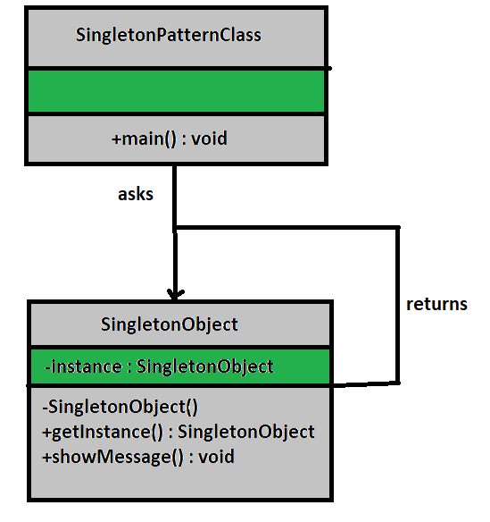

* Builder

Permite construir objetos complejos paso a paso. Este patrón nos permite producir distintos tipos y representaciones de un objeto empleando el mismo código de construcción.

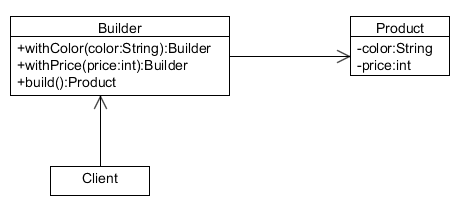

* Factory

El patrón Factory Method define un método que debe utilizarse para crear objetos, en lugar de una llamada directa al constructor (operador new). Las subclases pueden sobrescribir este método para cambiar las clases de los objetos que se crearán.

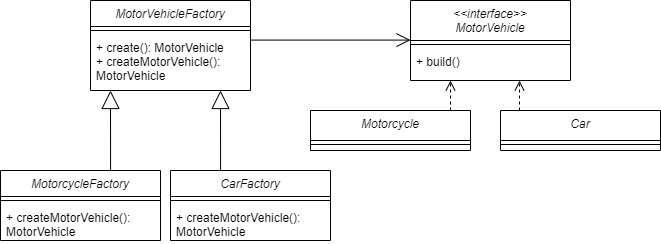

* Abstract Factory

El patrón Abstract Factory define una interfaz para crear todos los productos, pero deja la propia creación de productos para las clases de fábrica concretas. Cada tipo de fábrica se corresponde con cierta variedad de producto.

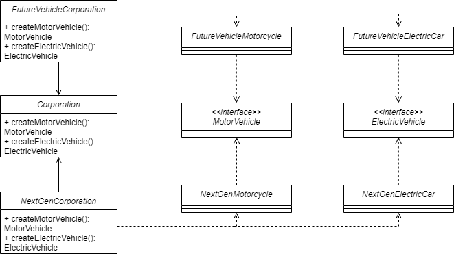

* Prototype

Todas las clases prototipo deben tener una interfaz común que haga posible copiar objetos incluso si sus clases concretas son desconocidas. Los objetos prototipo pueden producir copias completas, ya que los objetos de la misma clase pueden acceder a los campos privados de los demás.

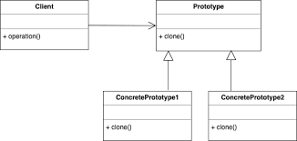

## Patrones Creacionales

* Adapter

Un patrón de adaptador actúa como un conector entre dos interfaces incompatibles que, de lo contrario, no se pueden conectar directamente. Un adaptador envuelve una clase existente con una nueva interfaz para que sea compatible con la interfaz del cliente.

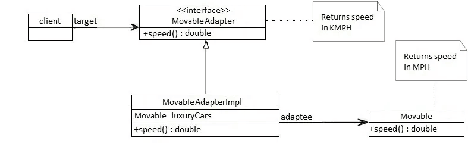

* Bridge

La definición oficial del patrón de diseño Bridge introducido por Gang of Four (GoF) es desacoplar una abstracción de su implementación para que las dos puedan variar de forma independiente.

Esto significa crear una interfaz de puente que utilice los principios de programación orientada a objetos para separar las responsabilidades en diferentes clases abstractas.

* Composite

El patrón compuesto está destinado a permitir el tratamiento de objetos individuales y composiciones de objetos, o "compuestos" de la misma manera.

Puede verse como una estructura de árbol formada por tipos que heredan un tipo base y puede representar una sola parte o una jerarquía completa de objetos.

Podemos dividir el patrón en: Componente base, Hoja, Compuesto

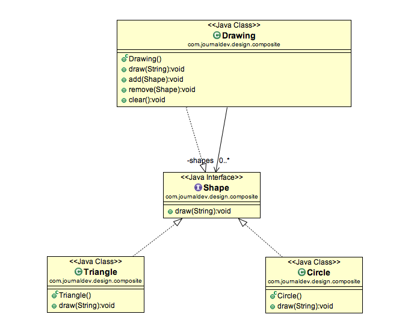

* decorator

Se puede usar un patrón Decorator para adjuntar responsabilidades adicionales a un objeto de forma estática o dinámica. Un decorador proporciona una interfaz mejorada para el objeto original.

En la implementación de este patrón, preferimos la composición a la herencia, de modo que podamos reducir la sobrecarga de subclasificar una y otra vez para cada elemento de decoración. La recursividad que implica este diseño se puede utilizar para decorar nuestro objeto tantas veces como lo necesitemos.

* facade

una fachada encapsula un subsistema complejo detrás de una interfaz simple. Oculta gran parte de la complejidad y hace que el subsistema sea fácil de usar.

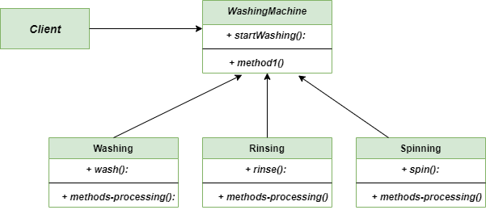

* flyweight
  
El patrón de diseño Flyweight se usa cuando necesitamos crear muchos Objetos de una clase. Dado que cada objeto consume espacio de memoria que puede ser crucial para dispositivos con poca memoria, como dispositivos móviles o sistemas integrados, se puede aplicar un patrón de diseño ligero para reducir la carga en la memoria al compartir objetos. 

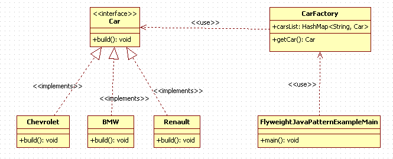

* proxy

El patrón Proxy nos permite crear un intermediario que actúa como una interfaz para otro recurso , al mismo tiempo que oculta la complejidad subyacente del componente.

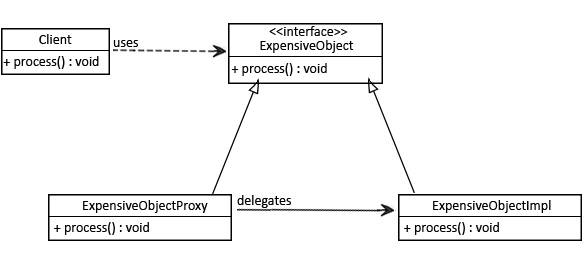

## Patrones de comportamiento

* Chain of responsibility

El patrón de cadena de responsabilidad se utiliza para lograr un acoplamiento débil en el diseño de software donde una solicitud del cliente se pasa a una cadena de objetos para procesarlos. Luego, el objeto en la cadena decidirá quién procesará la solicitud y si la solicitud debe enviarse al siguiente objeto en la cadena o no.

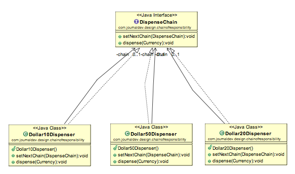

* Iterator

Patrón de diseño de iterador en uno de los patrones de comportamiento. El patrón de iterador se utiliza para proporcionar una forma estándar de atravesar un grupo de objetos. El patrón de iterador se usa ampliamente en Java Collection Framework . La interfaz de iterador proporciona métodos para atravesar una colección.

Según GoF, la intención del patrón de diseño del iterador es:

Proporciona una forma de acceder a los elementos de un objeto agregado sin exponer su representación subyacente.

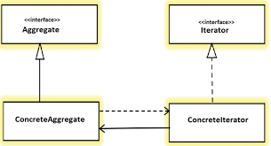

* Memento

El patrón Memento se utiliza para restaurar el estado de un objeto a un estado anterior. El patrón de Memento cae en la categoría de patrón de comportamiento.
El patrón Memento utiliza tres clases de actores. Memento contiene el estado de un objeto que se va a restaurar. El originador crea y almacena estados en los objetos Memento y el objeto Caretaker es responsable de restaurar el estado del objeto desde Memento. Hemos creado las clases Memento , Originator y CareTaker .

